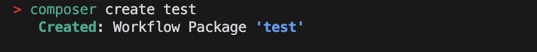
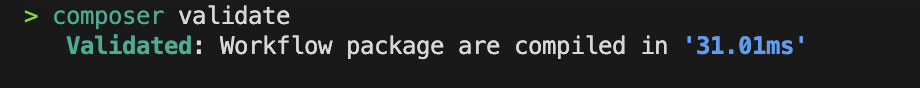
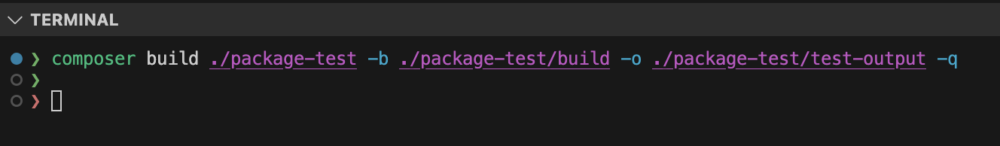

# Composer

[](https://www.apache.org/licenses/LICENSE-2.0)

## Introduction

The Composer is an integrated software package, encompassing both the Echo Library and Echo CLI components. This comprehensive solution is specifically tailored to streamline the process of generating WebAssembly (Wasm) files. The Echo Library serves as a foundational building block, offering a rich set of functionalities, while the Echo CLI excels in orchestrating the creation of Wasm files based on a specified list of configuration files. This sophisticated combination empowers developers by providing a seamless and organized approach to translating configuration parameters into fully functional web applications, enhancing the overall development experience.

 The Echo-Library and Echo-Cli tandem empower developers with a comprehensive solution for defining, managing, and executing workflows with ease. By harnessing Rust's capabilities, these tools provide a solid foundation for creating efficient and optimized WebAssembly files, offering developers a versatile toolkit to streamline their development processes.

## Prerequisite

- Ensure [Rust](https://www.rust-lang.org/tools/install) is installed and updated to the latest version.
  
## Getting started

- Clone the repository
  
  ```
  git clone https://github.com/HugoByte/composer.git
  ```

- Installing the echo-library

  ```
  cargo install --path ./cli
  ```

- Run
  
  ```
  composer -v
  ```

## Usage

- Creating the new Package
  
  ```
  composer create <package_name>
  ```

- Validating the config file
  
  ```
  composer validate
  ```


- Building the current package
  
  ```
  composer build
  ```


## Example

1. Create a new Package
   
   ```
   composer create test
   ```

    

2. Validate the created package, by changing the directory to the created package `cd` test`
   
   ```
   composer validate
   ```

    

3. Build the package
   
   ```
   composer build
   ```

4. Specifying the build and output directories
   
    

    Here,

    - `[SOURCE]` - The relative path or absolute path of the directory, where the package is located. This is an optional path if you are in the current directory.
    - `--build-directory or -b` - This is an optional path for the build directory to generate rust packages. this flag will be useful for debugging the generated rust package.

    - `--output or -o` - This is an optional path for storing the generated wasm files, by default an output directory will be generated at the current working directory.


> [!NOTE]
> To work with polkadot you need to install the following build library and export it
> 1. Install llvm@11 `brew install llvm@11` and
> 2. Export clan-11 as CC `export CC= /<path>/clang-11` 
> 3. Export llvm-ar as AR `export AR= /<path>/llvm-ar`.  
> 
> This step is necessary only if you are working with polkadot.


## License

Licensed under [Apache-2.0](https://www.apache.org/licenses/LICENSE-2.0)