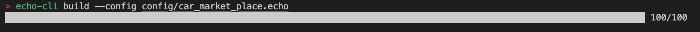

# Echo-cli

## Description

Echo-cli is a command-line interface designed to simplify the generation of WebAssembly (Wasm) binary files from configuration files. At the heart of Echo-cli lies the build command, complemented by a range of versatile options—version, help, verbose, config, and output—offering developers an intuitive and customizable toolkit.

## Prerequisite

- [RUST](https://www.rust-lang.org/tools/install)

## Usage

- Cloning the Repository
    ```
    git clone https://github.com/HugoByte/internal-research-and-sample-code.git
    ```

- Change the branch to `composer-dev`
- Install the echo-cli by running this command

    ```
    cargo install --path echo-cli
    ```

- Changing the directory to echo-cli
    ```
    cd echo-cli
    ```

- Run 
    ```
    echo-cli
    ```
    
## Commands

### Build

- `build` - Used to generate the wasm file from the given config file

    ```
    echo-cli build --config <config-path>
    ```

## Options or Flags

- `--config` - Takes the config-path
- `--output` - Represents the output filename (Optional)
- `--verbose` - A global option, when provided, sets the verbose field to true, suppressing CLI output.
  
  ```
  echo-cli build --config <config-path> --verbose
  ```

- `--version` - Gives the version
  
  ```
  echo-cli --version
  ```

- `--help` - Prints the help message

## Example

```
echo-cli build --config config/car_market_place.echo
```



## References

- [clap](https://crates.io/crates/clap)
- [clap-builder](https://crates.io/crates/clap_builder)

## License

Licensed under [Apache-2.0](https://www.apache.org/licenses/LICENSE-2.0)


