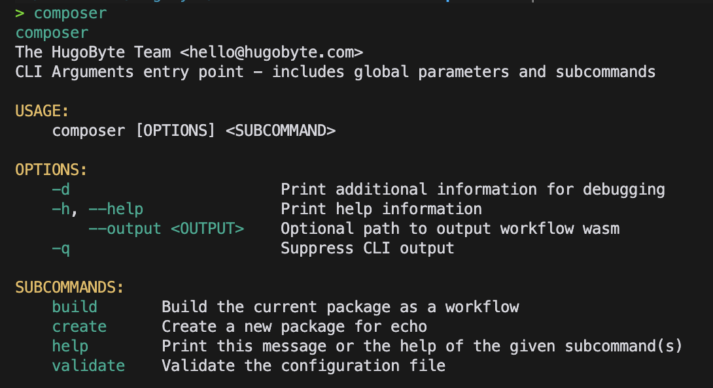

# Composer Package

Composer is a command-line tool that serves as a wrapper around the echo-library. Its primary functions include facilitating the creation of new packages, it plays a crucial role in managing dependencies. compiling user packages by generating WebAssembly (Wasm) files.

